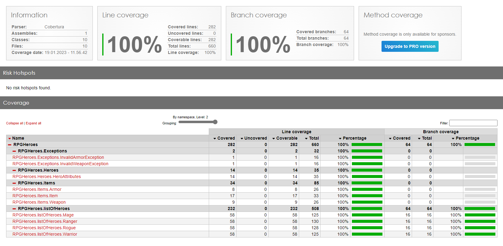

# Assignment1_CSharp

## Name
RPG Heroes

## Description
This is the first back-end assignment in Experis Academy up-skill program (01.23).
It includes the logics and calculations of heroes' level, strength, dexterity, intelligence and damage wearing user created items, such as armor and weapons. The purpose of this project was to get the basic knowladge of classes, methods, inheritence, exception handling, code documentation and various data types in C#.

## Installation
This project can be imported to any IDE that supports C#. No extra extensions are necesarry, except for Coverage tool, that displays how much (%) of the code is tested. 

## Usage
This project is run with tests. 
To check the funcionality of the project click: Test -> Run All Tests.
Possible approach could be using the main method to create heroes or items and displaying it in the console window.

## Project status
The requirements given in the project description are fullfilled.
The further use of this project can be extending its base funcionality or trying alternative approaches to practice OOP and OOD.

## Authors and acknowledgment
Developed by : Paulius Aleksandravicius

## Snapshot of the test coverage after running all tests
